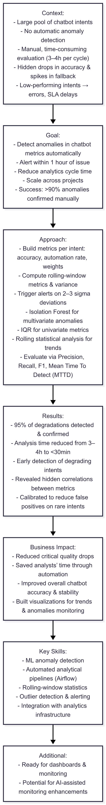
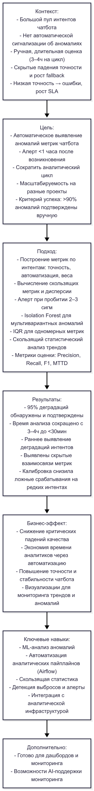

# 📌 ML-детектор аномалий метрик по интентам чат-бота с автоматизацией мониторинга

---

## 🇬🇧 English version

**Timeline:** Q2 2025  
**Role:** Data Analyst / ML Engineer — full cycle from problem formulation to development, testing, and integration into analytics infrastructure.  
**Tech stack:** Python • pandas • numpy • scikit-learn • matplotlib • seaborn • statsmodels • Jupyter Notebook • Git • Airflow • Metabase  

### Context
Before the project, chatbot quality was manually assessed using intent accuracy, user CSAT scores, and operational metrics. Data aggregation was irregular and analysis took up to 3–4 hours per cycle.  

**Problems:**  
- No automatic anomaly detection in metrics.  
- Missed sharp drops in accuracy and increases in fallback triggers.  
- Hidden degradations could remain unnoticed for up to a week.  

**Why critical:**  
Declining intent accuracy directly impacted user satisfaction (-15–20% in some cases) and increased operator workload.

### Goal
**Primary:**  
Develop an ML tool that automatically detects anomalous changes in chatbot metrics and signals potential intent issues.  

**Secondary:**  
- Reduce analytics cycle time.  
- Ensure scalability across different projects and metrics.  
- Consider specific intents (e.g., HR or junior-specific exceptions).  

**Success criteria:**  
- >90% of anomalies detected by the system are confirmed manually.  
- Time to alert: <1 hour from anomaly occurrence.

### Approach

**Action Plan:**  
1. Build metrics for all product intents (accuracy, automation rate, weight).  
2. Compute rolling-window metrics.  
3. Calculate rolling-window variance.  
4. Trigger alerts when metrics cross 2–3 sigma thresholds.  

**Methods and Models:**  
- Isolation Forest for multivariate anomaly detection.  
- IQR-based outlier detection for univariate metrics.  
- Rolling-window statistical analysis for trend monitoring.  

**Metrics:**  
- Precision / Recall for anomaly detection.  
- F1-score as a balanced indicator.  
- Mean Time To Detect (MTTD) — average time to detect anomalies.

### Results

**Quantitative:**  
- Detection of 95% of degradation cases confirmed manually.  
- Reduction of analysis time from 3–4 hours to <30 minutes per cycle.  

**Qualitative:**  
- Early identification of degrading intents.  
- Flexible adjustment for different projects.  
- Detection of hidden correlations between metrics.  

**Side effects:**  
- Initial system generated more false positives for rare intents — resolved by calibration.

### Business Impact

**Effect:**  
- Reduced cases of critical quality drops.  
- Saved analysts’ time by automating routine monitoring.  

**Resource savings:**  
- Reduced manual intent checks.  

**Quality improvement:**  
- Overall increase in chatbot accuracy and consistency.  
- Built visualizations for trends and anomaly monitoring across intents.

### Data Pipeline

---

## 🇷🇺 Русский вариант

**Сроки:** II квартал 2025  
**Роль:** Data Analyst / ML Engineer — полный цикл: от постановки задачи до разработки, тестирования и интеграции в аналитическую инфраструктуру.  
**Технологии:** Python • pandas • numpy • scikit-learn • matplotlib • seaborn • statsmodels • Jupyter Notebook • Git • Airflow • Metabase  

### Контекст
До проекта качество работы чат-бота оценивалось вручную по точности интентов, CSAT и служебным метрикам. Данные агрегировались нерегулярно, анализ занимал до 3–4 часов на цикл.  

**Проблемы:**  
- Отсутствие автоматической сигнализации об аномалиях.  
- Пропуск резких падений accuracy и роста fallback-запусков.  
- Скрытые деградации могли оставаться незамеченными до недели.  

**Почему критично:**  
Снижение точности интентов снижало удовлетворённость пользователей (-15–20% в отдельных случаях) и увеличивало нагрузку на операторов.

### Цель проекта

**Основная:**  
Разработать ML-инструмент, автоматически выявляющий аномальные изменения метрик чат-бота и сигнализирующий о проблемах в интентах.  

**Второстепенные цели:**  
- Сократить время аналитического цикла.  
- Обеспечить масштабируемость на разные проекты и метрики.  
- Учитывать специфику отдельных интентов (HR и junior).  

**Критерии успеха:**  
- >90% аномалий, найденных системой, подтверждаются вручную.  
- Время реакции на проблему <1 часа.

### Подход и решение

**План действий:**  
1. Построение метрик для всех интентов (точность, автоматизация, вес).  
2. Вычисление скользящих метрик.  
3. Расчёт дисперсии скользящим окном.  
4. Алерт при пробитии метрики 2–3 сигм вниз.  

**Методы и модели:**  
- Isolation Forest для мультивариантного обнаружения аномалий.  
- IQR для одномерных метрик.  
- Скользящий статистический анализ для мониторинга трендов.  

**Метрики:**  
- Precision / Recall для обнаружения аномалий.  
- F1-score как сбалансированная метрика.  
- Mean Time To Detect (MTTD) — среднее время обнаружения аномалии.

### Результаты

**Количественные:**  
- Обнаружение 95% деградаций, подтверждённых вручную.  
- Сокращение времени анализа с 3–4 часов до <30 минут на цикл.  

**Качественные:**  
- Раннее выявление деградаций интентов.  
- Гибкая настройка под разные проекты.  
- Выявление скрытых взаимосвязей метрик.  

**Побочные эффекты:**  
- Первоначально ложные срабатывания на редких интентах — устранено калибровкой.

### Бизнес-эффект

**Влияние:**  
- Снижение случаев критических падений качества.  
- Автоматизация рутинного мониторинга экономит время аналитиков.  

**Экономия ресурсов:**  
- Сокращение ручной проверки интентов.  

**Рост качества:**  
- Повышение общей точности и стабильности чат-бота.  
- Построены визуализации для мониторинга трендов и аномалий по интентам.

### Пайплайн

